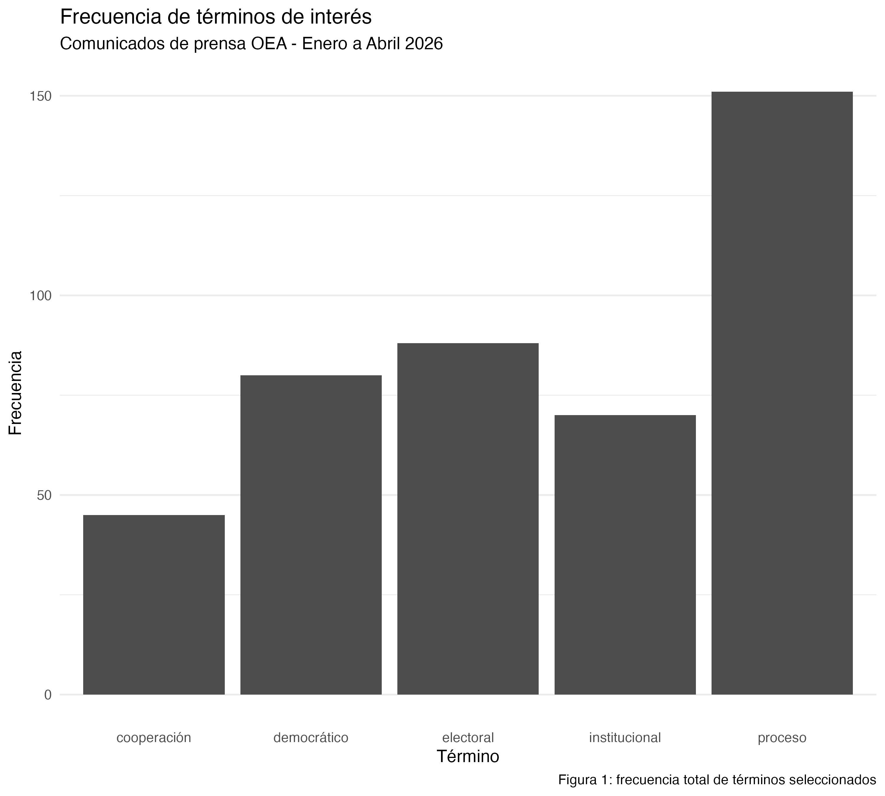

```{r}
---
title: "Informe OEA"
date: "`r Sys.Date()`"
format: html
---
```

Este trabajo busca analizar los comunicados de prensa de la Organización de los Estados Americanos (OEA) desde enero a abril del año 2026.

Para lograrlo y entender qué temas son relevantes para su agenda insititucional, dividimos el análisis en tres ramas: (1) web scraping en el script "scraping_oea.R", (2) limpieza y lematización en el script "processing.R" y (3) frecuencias y visualizaciones en el script "metrics_figures.R".

En primer lugar, en scraping_oea.R descargamos los comunicados de la OEA para el periodo a analizar y extraemos los titulos y los cuerpos de cada comunicado mediante dos funciones (scrapear_comunicados y scrapear_cuerpo). En este script se guarda una tabla "comunicados_oea.rds" con las variables id, titulo y cuerpo en la carpeta /data. En segundo lugar, en processing.R tomamos esa tabla, limpiamos el texto del cuerpo eliminando caracteres especiales, signos de puntuacion y espacios multiples. A su vez, lematizamos cada comunicado y nos quedamos únicamente con sustantivos, verbos, adjetivos y removermos stopwords. Por último, en metrics.figures.R construimos una matriz de frecuencia de términos con el cuerpo lematizado y, habiendo visto los términos más frecuentes, elegímos 5 relevantes para el contexto insititucional de la OEA. En este último script generamos también un gráfico de barras con sus frecuencias totales a lo largo de todos los comunicados.

### Ejecución

```{r}
library(here)
#ejecutar cada etapa en orden 
source(here("TP2/scripts/scraping_oea.R"))
source(here("TP2/scripts/processing.R"))
source(here("TP2/scripts/metrics_figures.R"))
```

### Resultados

La figura 1 presenta la frecuencia de los cinco términos seleccionados de los comunicados de la OEA entre enero y abril de 2026.

{width="546"}

### Interpretación

El gráfico muestra al término "proceso" como el más frecuente dentro de los comunicados analizados, con un poco más de 150 apariciones. Este término atraviesa transversalmente a los otros cuatro términos seleccionados. Haciendo un análisis en profundidad de las declaraciones de la OEA, vemos que al hablar de proceso refieren a procesos electorales, procesos democraticos y procesos insititucionales que refieren a naciones como Costa Rica, Honduras, Venezuela, Haiti, Guatemala, entre otros.

En linea con esto, "electoral" es el segundo término más frecuente con 88 apariciones. Esto puede tomarse como evidencia de que la agenda de la OEA en el periodo dado se centró en el monitoreo de procesos electorales en el continente Americano. Los términos "democrático" e "intitucional" aparecen con frecuencias similares (80 y 70 apariciones), siguiendo el hilo de la Organización como foro político que se rige por principios democráticos e insititucionales, buscando fomentarlo en todos los Estados.

Por último, "cooperación" aparece con la menor frecuencia entre los términos seleccionados (45 apariciones). Sin embargo, aparece entre los 30 términos más frecuentes de todos los comunicados analizados. Con esto, podemos notar que la colaboración entre los Estados miembros sigue siendo clave en su agenda isnitucional ya que, sin cooperación no se pueden llevar a cabo de manera exitosa sus pilares de fortalecimiento de la democracia y transparencia electoral en el continente.
